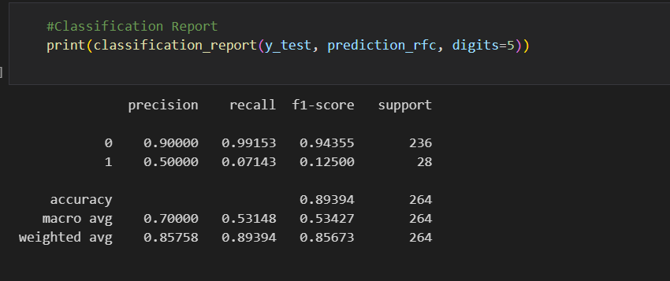
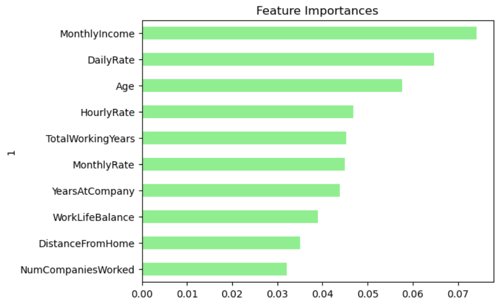
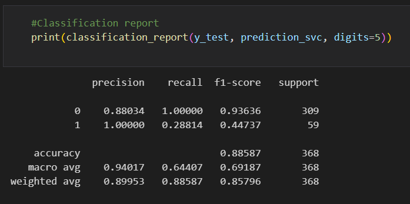
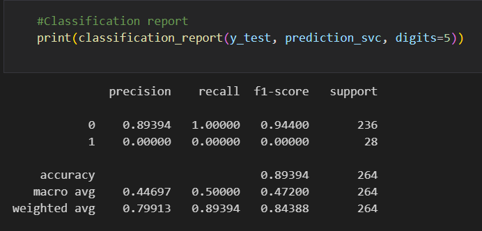
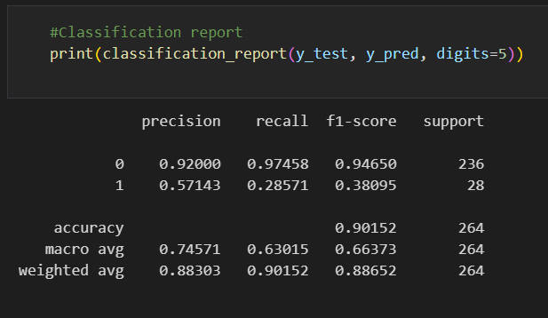
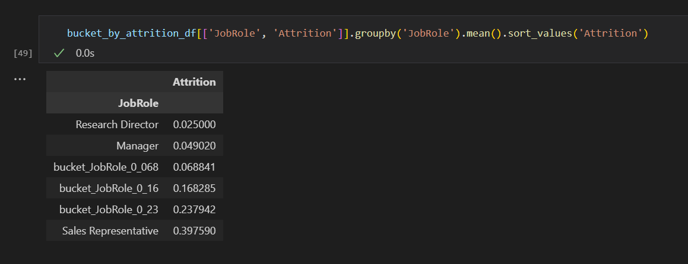
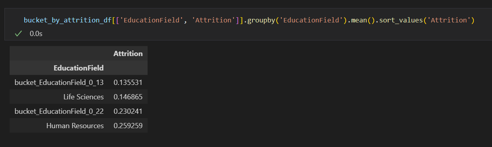
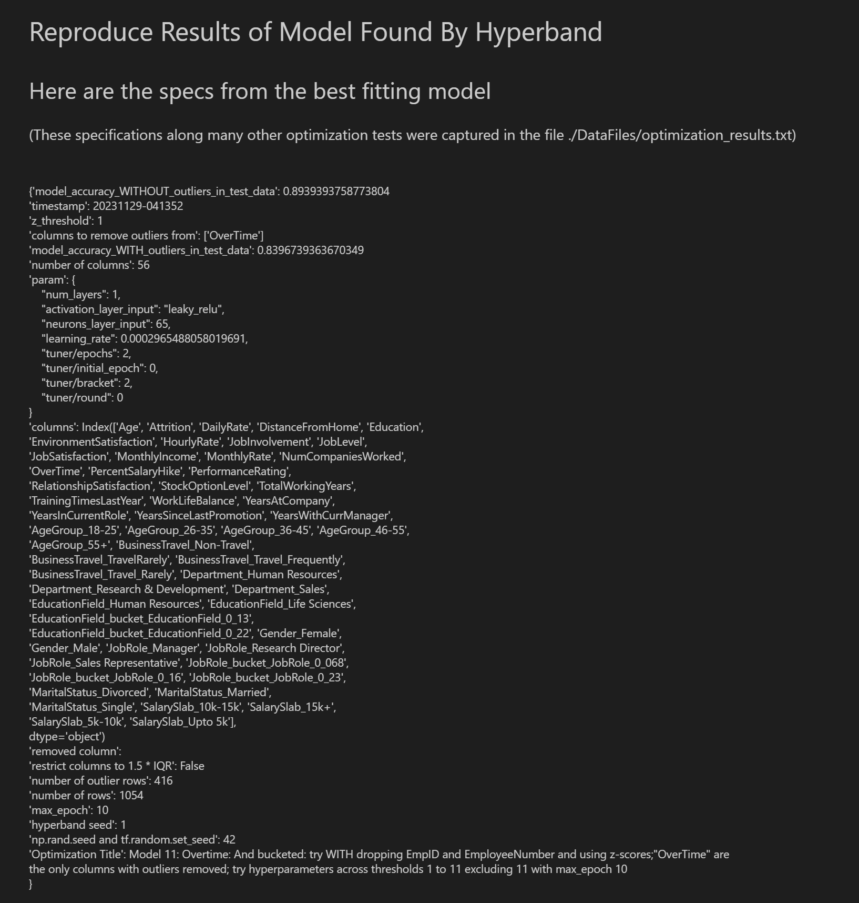

# Sticking Together: A Look Into Attrition
## Comparison Machine Learning Project

# Contributors
  •	Karoly Burgyan 
  •	Shayla Badeaux 
  •	Christian Cantu 

# Sources
1.	[Database Source](https://www.kaggle.com/datasets/anshika2301/hr-analytics-dataset?select=HR_Analytics.csv)
2.	[Chat GPT](https://chat.openai.com/)
3.	[Stack Overflow](https://stackoverflow.com/)
4.	[Scikit-Learn](https://scikit-learn.org/stable/)
5.	[Hyperband Tuner](https://keras.io/api/keras_tuner/tuners/hyperband/)
7.	[Cultermap](https://web.archive.org/web/20230913171706/https://www.cultureamp.com/blog/cost-of-employee-turnover)
8.	[Investopedia](https://www.investopedia.com/terms/a/attrition.asp)

# Overview
HR analytics, commonly known as people analytics, workforce analytics, or talent analytics, involves the aggregation, analysis, and presentation of HR data. It encompasses the collection and application of talent-related information to enhance key talent and business outcomes. This practice enables your organization to evaluate the impact of various HR metrics on overall business performance, fostering data-driven decision-making. Professionals in this field are primarily responsible for interpreting and analyzing extensive datasets. 
In parallel, utilizing a comparison of machine learning models, such as neural networks, random forests, support vectors, and logistical regression, is explored to accurately predict employee resignations(attrition) from their respective roles. This comparison aims to leverage advanced analytical tools for a more insightful understanding of workforce dynamics. 

[Presentation Slides](https://docs.google.com/presentation/d/12RUXDCDHZtxtUFoaoBHiP8SCMSqjNNB0ViUJQJipwIE/edit#slide=id.gd9c453428_0_16) 

# Questions
  1. What correlations suggest better retention?
  2. What prediction models can help increase the likelihood of retention?
   

# Data Overview
Initial processing before getting into questions.
## Data Preprocessing
<ul>
<li>What variable(s) are the target(s) for your model?</li>The target for the model was:
<ul>
<li>Attrition—An employee choosing to leave</li>
</ul>
<li>What variable(s) are the features for your model?</li>
The features for the model were:
<ul>
 <li>'Age'--employee age</li>
 <li>'AgeGroup'--employee age group</li>
 <li>'BusinessTravel'--how much business travel</li>
 <li>'DailyRate'--money billed to company customers by employee activity per daily</li>
  <li>'Department'--department of position</li>
  <li>'DistanceFromHome'--distance from home</li>
  <li>'Education'--education level</li>
  <li>'EducationField'--major</li>
        <li>'EnvironmentSatisfaction'--how satisfied was the employee with work environment</li>
        <li>'Gender'--gender</li>
        <li>'HourlyRate'--money billed to company customers by employee activity per hour</li>
       <li>'JobInvolvement'--how much time spent on work outside of official work hours</li>
       <li>'JobLevel'-- authority level of employee position</li>
       <li>'JobRole'-- name of position</li>
       <li>'JobSatisfaction'-- satisfaction with job as whole</li>
       <li>'MaritalStatus'-- marital status</li>
       <li>'MonthlyIncome'-- monthly income</li>
       <li>'SalarySlab'-- salary bracket</li>
       <li>'MonthlyRate'--money billed to company customers by employee activity per month</li>
       <li>'NumCompaniesWorked'-- number of companies an employee has worked for</li>
       <li>'OverTime'-- the employee is tasked with overtime frequently</li>
       <li>'PercentSalaryHike'-- percent salary hike annually</li>
       <li>'PerformanceRating'-- performance of employee as judged by supervisor</li>
       <li>'RelationshipSatisfaction'--relationship satisfaction of employee to supervisor</li>
       <li>'StockOptionLevel'-- stock options levels</li>
       <li>'TotalWorkingYears'--total years an employee has worked in the current field</li>
       <li>'TrainingTimesLastYear'--number of training periods in the last year</li>
       <li>'WorkLifeBalance'-- work life balance</li>
       <li>'YearsAtCompany'-- years at company</li>
       <li>'YearsInCurrentRole'--years in current role</li>
       <li>'YearsSincLastPromotion'--years since last promotion</li>
       <li>'YearsWithCurrManager'--years with current manager</li>
</ul>
<li>What variable(s) should be removed from the input data because they are neither targets nor features?</li>
<ul>
<li>EmpID—'Identification column'</li>
<li>EmployeeNumber'--Identification column'</li>
<li>'EmployeeCount'--number of employees a row accounts for (the value was always '1' so it was irrelevant)</li>
<li>'Over18'--is the employee over 18 (value was always 'yes' so it was irrelevant)</li>
<li>'StandardHours'--is a basis for comparison (the value was always '80' so it was irrelevant)</li>
</ul>

<li>What outliers, if any, were removed?</li>
<ul>
<li>Outliers as defined by a z-score of 1 for 'OverTime' were removed1</li>
</ul>
</ul>

Now, let's look at the models.

1 This was the most salient outlier z-score but there were about 300 distinct outlier z-scores tested in the neural network models using a hyperband tuner.

# Question 1: What correlations suggest better retention?

We decided the best way to view any correlations was with the calculations of R-squared of our independent variables(y), against our dependent variable(X), attrition. We also wanted to visually see these factors plotted against attrition and did so using Tableau.  

[Tableau Workbook](https://public.tableau.com/app/profile/shayla.badeaux/viz/HRBook_17012903593280/AttritionAtAGlance?publish=yes)   

 
      
      
      
     
 # Question 2: What prediction models can help increase the likelihood of retention?
In total there were 3 Random Forest Classifier Models, 3 Support Vector Models, 3 Logistic Regression Models, and 98 Neural Network Models created and considered in order to find the highest accuracy. Here, for the sake of brevity, only the top models of each are discussed (See HR_Analysis_RFC_SVM_LogReg.ipynb for details on the other Random Forest Classifier Models, Support Vector Models, and Logistic Regression Models and see HR_Analysis_Neural_Network.ipynb for more details on the other 97 neural network models).
# Random Forest Classifier Model

Random forests or random decision forests are constructed during the training phase in order to help classify the output. Random decision trees help in correcting the habit of overfitting with regular decision trees. Random forests are a way of averaging multiple deep decision trees, trained on different parts of the same training set, with the goal of reducing the variance. With n_estimators= 200 was used out of a database with 1470 records. 

## Random Forest Classifier Model31
The accuracy of Random Forest Classifier Model3 was 85.870% which was 10.870% higher than the goal of 75% when ran against 1470 datapoints out of 1470 datapoints. When outlier datapoints for 'Overtime' were removed with a z-score threshold of 1 returning 1054 datapoints out of 1470 datapoints, the accuracy was 89.394%.  

Here is the classification report for the 1054 datapoints out 1470 datapoints2:  
 

Here is the feature importance for prediction:  
 

The "Feature Importances" are importance of contribution of a feature's value for the Random Forest Classifier Model3's predictions (Monthly Income being the most significant feature).

1 For the less accurate models, Random Forest Classifier Model1 and 2, see HR_Analysis_RFC_SVM_LogReg.ipynb  

2 Note that the support of 264 corresponds to the number of datapoints in the testing set from among the 1054 datapoints.

# Support Vector Model
Support vector machines, also known as support vector networks, represent a robust form of predictive machine learning. SVM accomplishes this by mapping training data onto points in space to optimize the gap width between two categories. Subsequently, test or new data is plotted or predicted to belong to either of those two categories based on its position in relation to the gap. 
Classification Report:  

## Support Vector Model21
The accuracy of Support Vector Model2 had an accuracy of 88.587% which was 13.587% higher than the goal of 75% when ran against 1470 datapoints out of 1470 datapoints. However, Support Vector Model2 was NOT tested against z-score-1-outliers-removed data because it has an incompatible number of features when compared with the number of features of z-score-1-outliers-removed data.  

Here is the classification report for the 1470 datapoints out 1470 datapoints:  
 

1 For the less accurate model, Support Vector Model1, see HR_Analysis_RFC_SVM_LogReg.ipynb  

## Support Vector Model31
The accuracy of Support Vector Model3 had an accuracy of 88.043% which was 13.043% higher than the goal of 75% when ran against 1470 datapoints out of 1470 datapoints. When outlier datapoints for 'Overtime' were removed with a z-score threshold of 1 returning 1054 datapoints out of 1470 datapoints, the accuracy was 89.394%.  

Here is the classification report for the 1054 datapoints out 1470 datapoints:  
 

1 For the less accurate model, Support Vector Model1, see HR_Analysis_RFC_SVM_LogReg.ipynb  

# Logistic Regression Model
Logistic regression assesses the likelihood of an event, such as job resignation, by considering a dataset with designated independent variables denoted as X.

## Logistic Regression Model31
The accuracy of Logistic Regression Model3 had an accuracy of 88.315% which was 13.315% higher than the goal of 75% when ran against 1470 datapoints out of 1470 datapoints. When outlier datapoints for 'Overtime' were removed with a z-score threshold of 1 returning 1054 datapoints out of 1470 datapoints, the accuracy was 90.152%.

Here is the classification report for the 1054 datapoints out 1470 datapoints:  
 

1 For the less accurate models, Logistic Regression Model1 and 2, see HR_Analysis_RFC_SVM_LogReg.ipynb  

# Preliminary Conclusion For Random Forest Classifier, Support Vector, And Logistic Regression Models1

The Support Vector Model2 had the highest accuracy of 88.587% against all 1470 rows compared to Logistic Model3's 88.315%, Support Vector Model3's 88.043%, and Random Forest Classifier Model3's 85.870%. However, when tested against z-score 1 restricted data (in reference to the Overtime column).2 The Logistic Regression Model3 had the highest accuracy of 90.152 against 1054 rows out of 1470 rows3 as compared to Support Vector Model3's 89.394% and Random Forest Classifier Model3's 89.394%.  

So, in summary, of the 9 models here, the Logistic Regression Model3 and Support Vector Model3 are nearly identical in performance are tied for the best all around models. 

1The Neural Network Models will be discussed next. See HR_Analysis_Neural_Network.ipynb for Final Conclusion.

2 Support Vector Model2 was NOT tested against z-score-1-outliers-removed data because it has an incompatible number of features (62 features as opposed to 61) that's why Support Vector Model3 was created and used.

3 The z-score-1-outliers-removed data reduces the number of rows to 1054 rows out of 1470 rows.

# Neural Network Model

## Compiling, Training, and Evaluating the Model

<ul>
<li>How many neurons, layers, and activation functions did you select for your neural network model, and why?</li>
With the help of keras_tuner.Hyperband, the model chosen was the model that it found to have the highest accuracy when varying the number of layers, neurons, and activation functions.  The specs for the model chosen were as follows:
<ul>
<li>number of layers (excluding the output layer) -- 1</li>
<li>number of neurons in each layer (starting from the input layer)-- 651</li>
<li>activation function for each layer (starting from the input layer (excluding the output layer which used 'sigmoid')) -- 'leaky_relu'</li>
<li>learning rate -- 0.0002965</li>
<li>optimizer -- 'adam'</li>
<li>output activation function -- 'sigmoid'</li>
<li>buckets -- 5 buckets (3 for 'JobRole' and 2 for 'EducationField')</li>
    
    
<li>outlier limit -- 1 z-score threshold</li>
</ul> 
<li>Were you able to achieve the target model performance?</li>
Yes, the model had an accuracy of 83.967% which was 8.967% above the 75% target.
     
<li>What steps did you take in your attempts to increase model performance?</li>
<ul>
    <li>epochs -- the number of epochs were varied from 1 to 10</li>
    <li>layers -- (including input layer but excluding output layer) were varied from 1 to 6</li>
    <li>neurons per layer -- were varied from 2 to 2 X the number of features</li>
    <li>number of features -- were varied from 33 to 1533</li>
    <li>activation functions -- were varied between 'relu', 'leaky_relu', and 'tanh' (for all layers except output layer which used 'sigmoid')</li>
    <li>number of bucket -- varied from 0 to 5</li>
    <li>removed outliers -- varied from a z-score limit of 1 to 11</li>
    <li>learning rate -- varied from 0.0001 to 0.01 for an 'adam' optimizer</li>

</ul>
</ul>

So, now onto conclusions.

1 Doesn't include the 1 neuron in the output layer.

# Preliminary Conclusion For Neural Network Models1

After creating and analyzing nearly 100 models (including the models from the Z-Series), the Neural Network Model11 shows the most promise of the Neural Networks because it has an accuracy of 89.394% on 1054 out 1470 rows (z-score-threshold of 1 removes 416 rows) and 83.967% on 1470 out 1470 rows. This model has 1 layer (including the input layer but excluding the output layer) of 65 neurons and uses 'leaky_relu' as its activation for this layer, 'sigmoid' for the output layer, and a learning rate of '0.0002965' with an 'Adam' Optimizer.

1The Neural Network Models will be compared with the Random Forest Classifier, Support Vector, and Logistic Regression Models next.

# Final Conclusions
The Support Vector Model2 had the highest accuracy of 88.587% against all 1470 rows compared to Logistic Model3's 88.315%, Support Vector Model3's 88.043%, and Random Forest Classifier Model3's 85.870%, and Nerual Network Model11's 83.967%. However, when tested against z-score 1 restricted data (in reference to the Overtime column).2 The Logistic Regression Model3 had the highest accuracy of 90.152 against 1054 rows out of 1470 rows3 as compared to Support Vector Model3's 89.394%, Random Forest Classifier Model3's 89.394%, and Neural Network Model's 89.394%.  

So, in summary, of the 100+ models considered4, the Logistic Regression Model3 and Support Vector Model3 are nearly identical in performance are tied for the best all around models. 

2 Support Vector Model2 was NOT tested against z-score-1-outliers-removed data because it has an incompatible number of features (62 features as opposed to 61) that's why Support Vector Model3 was created and used.

3 The z-score-1-outliers-removed data reduces the number of rows to 1054 rows out of 1470 rows.

4 98 Neural Network Models, 3 Random Forest Classifier Models, 3 Support Vector Models, and 3 Logistic Regression Models.

